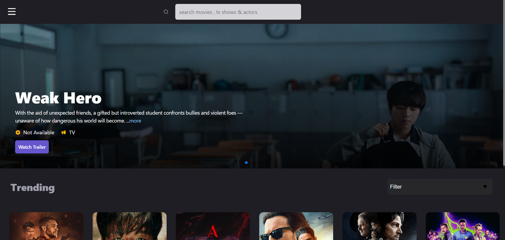
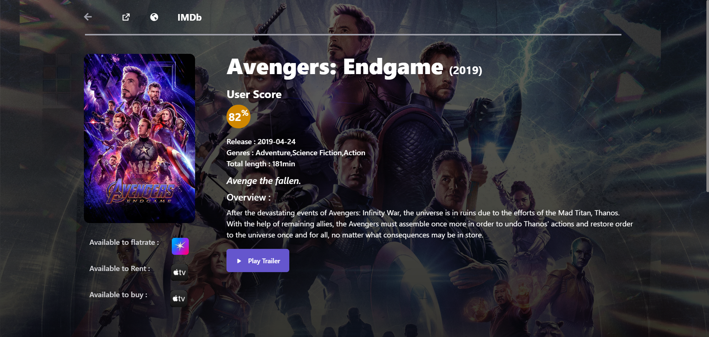
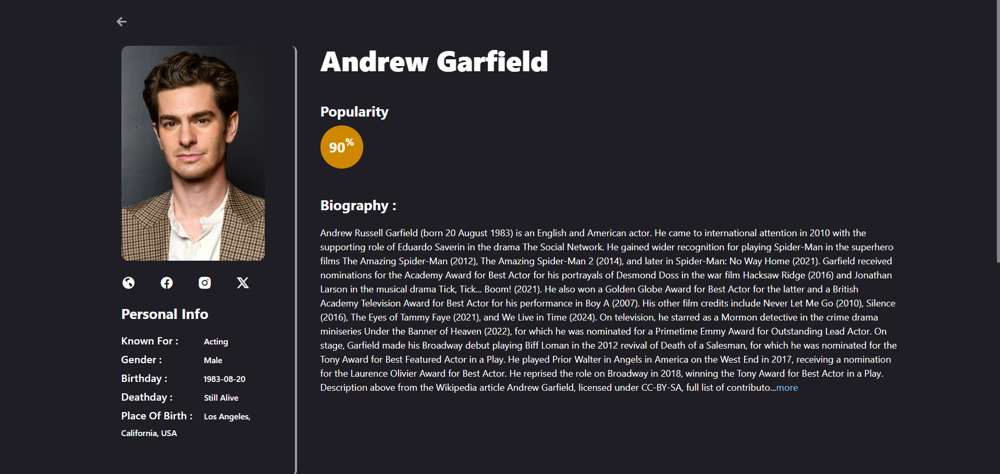
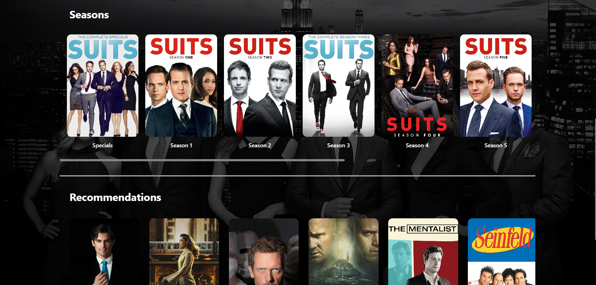

# 🎬✨ React Movie Website

A modern, beautiful, and fully responsive Movie Website built with React.js, Redux Toolkit, and Tailwind CSS 🚀
Search for movies, browse trending ones, and view details with a stunning UI!

## 🏗️ Tech Stack

• Frontend: React.js, Redux Toolkit  
• Styling: Tailwind CSS  
• Routing: React Router  
• API: (TMDB)  

## ✨ Features

✅ Responsive design (Mobile, Tablet, Desktop)  
✅ Redux for efficient state management  
✅ Real-time Movie Search  
✅ Dynamic routing for movie details  
✅ Loading states and error handling  
✅ Beautiful UI animations  
✅ Clean, reusable code structure  

## 🖼️ Screenshots

  
  
  
  

## 💬 Feedback

Have an idea, a feature request, or a bug report?  
Feel free to open an issue or submit a pull request.  
Your contributions are welcome and appreciated! 🤝  

## 🙏 Acknowledgements

• React.js  
• Redux Toolkit  
• Tailwind CSS  

The Movie Database (TMDB) (TMDB API)  

Made by Aditya Singh  

# 🔗 Live Demo
👉 Click below to visit the live site
[Live Demo](https://react-movie-site-nu.vercel.app/)
